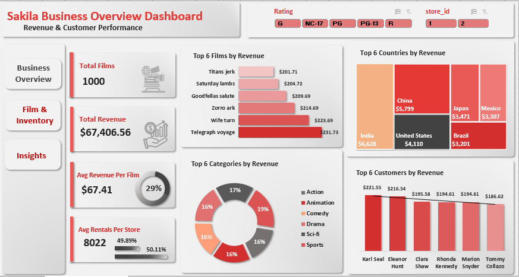
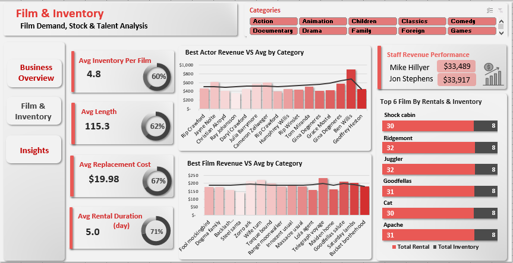
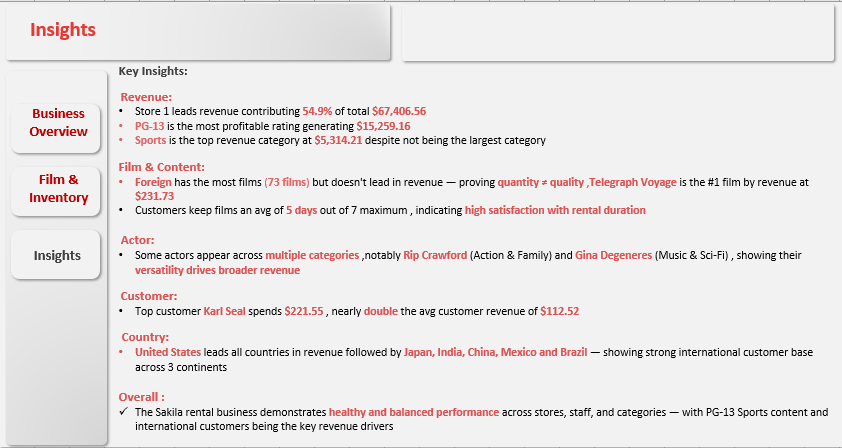
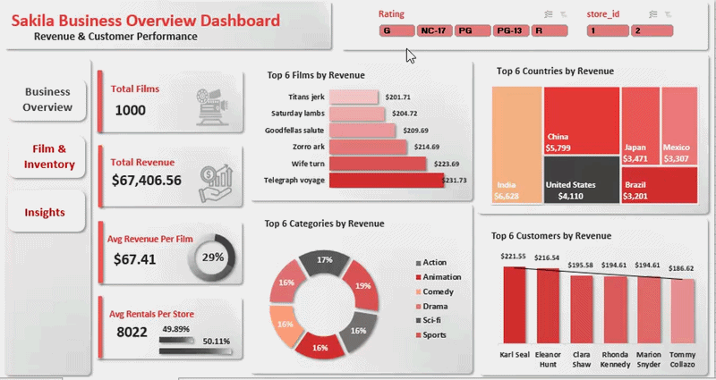
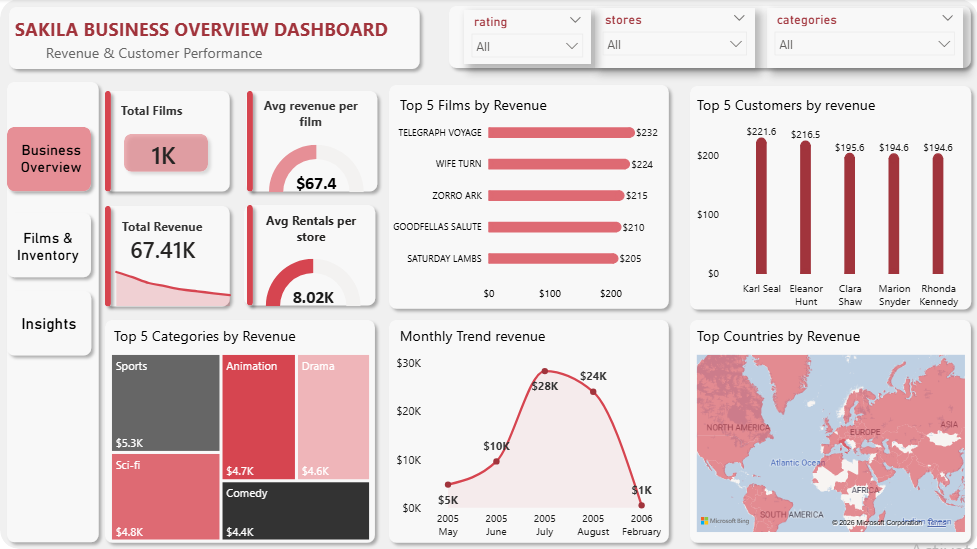
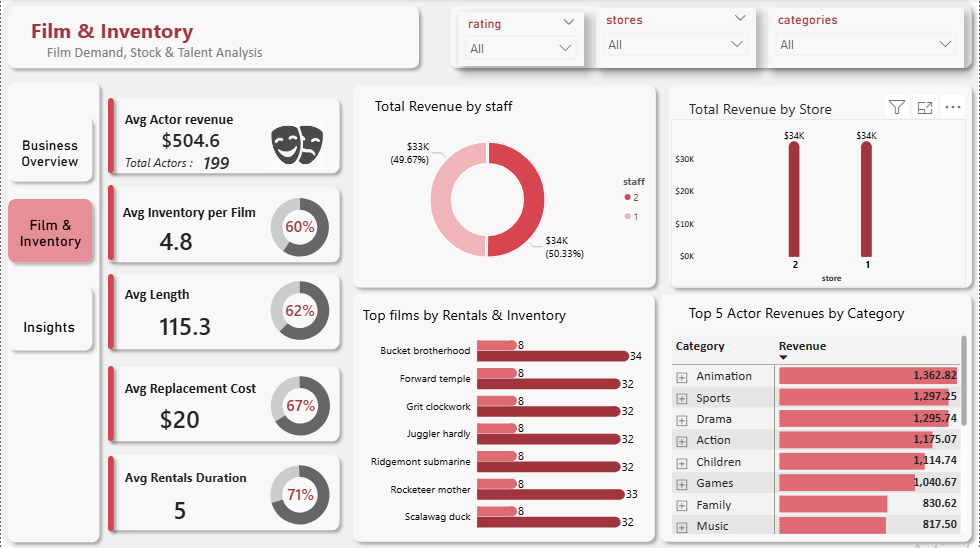
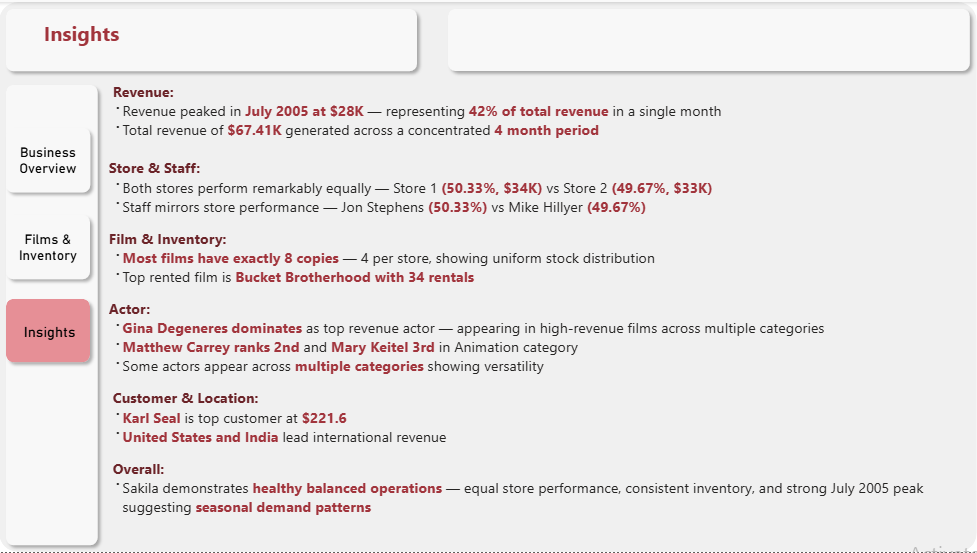
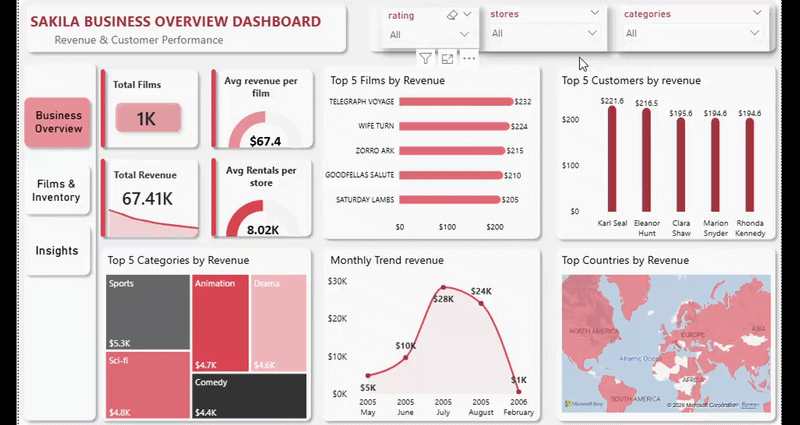

Sakila DVD Rental — Data Cleaning & Exploratory Data Analysis (SQL)
## Project Overview

This project presents a complete end-to-end data analytics workflow applied to the Sakila DVD Rental database — a fictional DVD rental business dataset provided by MySQL. 
It covers data cleaning and transformation using SQL, exploratory data analysis to identify trends and patterns, and the development of interactive dashboards in Excel and Power BI.
The goal is to analyze revenue, film performance, customer behavior, inventory distribution, and actor insights to derive meaningful business conclusions.

##Tools & Technologies
MySQL 8.0
SQL (CTEs, Window Functions, Joins, Aggregations)
Microsoft Excel (Power Pivot, Pivot Tables, Dashboard & Analysis)
Power BI Desktop (Interactive Dashboard, DAX Measures, Data Modeling)
GitHub (Version Control)

##Project Structure
data_cleaning_sakila.sql — SQL scripts for cleaning and standardizing the Sakila dataset
eda_sakila.sql — SQL exploratory data analysis queries
sakila_dashboard_excel.xlsx — Excel interactive dashboard
sakila_dashboard_powerbi.pbix — Power BI dashboard
images/ — dashboard screenshots & demos
README.md — project documentation

## Data Source
The Sakila sample database is provided by MySQL and is publicly available at the 
[MySQL Official Site](https://dev.mysql.com/doc/sakila/en/).
Due to its public nature, raw database files are not included in this repository.

**Dataset highlights:**
- Total Films: 1,000
- Total Customers: 599
- Total Actors: 200
- Total Stores: 2
- Period: May 2005 – February 2006

All core tables (actor, address, category, city, country, customer, 
film, film_actor, film_category, inventory, payment, rental, staff, 
store) were fully cleaned and validated before analysis.

## Data Cleaning Steps
Created staging and working tables to preserve raw data
Removed duplicate records using window functions
Standardized text formatting and naming conventions
Handled missing and NULL values
Cleaned invalid phone numbers and postal codes
Validated relationships between tables using foreign keys
Removed inconsistent or invalid records
Ensured referential integrity across all core tables

## Exploratory Data Analysis (EDA)
Analyzed film characteristics such as category, rating, and length
Identified top-performing films by rentals and revenue
Examined customer rental behavior and spending patterns
Analyzed revenue by category, country, store, and staff
Investigated rental duration and inventory distribution
Ranked top actors by attributed revenue within categories
Explored geographic distribution of customers and revenue
Evaluated monthly revenue trends and seasonal demand

## Dashboards

#Excel Dashboard
Interactive dashboard using Power Pivot, Pivot Tables, Pivot Charts, DAX Measures, and Slicers.
Includes:
Business Overview
Film & Inventory Analysis
Revenue & Customer Insights
Interactive filtering by Rating, Store, and Category
Key findings & dashboard insights

#Power BI Dashboard
Interactive dashboard with multiple report pages and dynamic filtering.
Features:
KPI Cards & Dynamic Metrics
Filled Maps, Bar Charts, Combo Charts, Treemaps, Matrix Visuals
DAX Measures & Dynamic Ranking (RANKX)
Monthly Revenue Trend Analysis
Rating, Store & Category Slicers
Interactive drill-down analysis

## Dashboard Preview

###Excel Dashboard
#Business Overview

#Film & Inventory

#Insights

#Dashboard Demo

###Power BI Dashboard
#Business Overview

#Film & Inventory

#Insights

#Dashboard Demo

## Key Insights
Total revenue reached $67.4K during the active rental period
Revenue peaked in July 2005, showing strong seasonal demand
Sports generated the highest category revenue despite not having the largest inventory
Foreign contained the most films but did not lead revenue generation
PG-13 films generated the highest revenue among all ratings
Telegraph Voyage was the top film by revenue
Inventory distribution remained highly balanced across both stores
Both stores generated nearly identical revenue performance
Top customers spent almost double the average customer revenue
The United States generated the highest international revenue contribution

## Notes
The dataset contains only 2 stores and limited time coverage, restricting long-term trend analysis and year-over-year comparisons.

##Data Pipeline
Raw Sakila Database (MySQL)
Data Cleaning & Transformation (SQL)
Exploratory Data Analysis (SQL)
Data Export & Flat Table Preparation
Dashboard Development in Excel
Dashboard Development in Power BI

 ##Author

HajarEzzy
SQL | Excel | Power BI | Data Analytics

